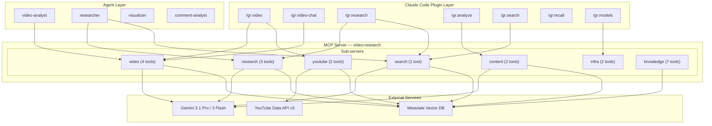
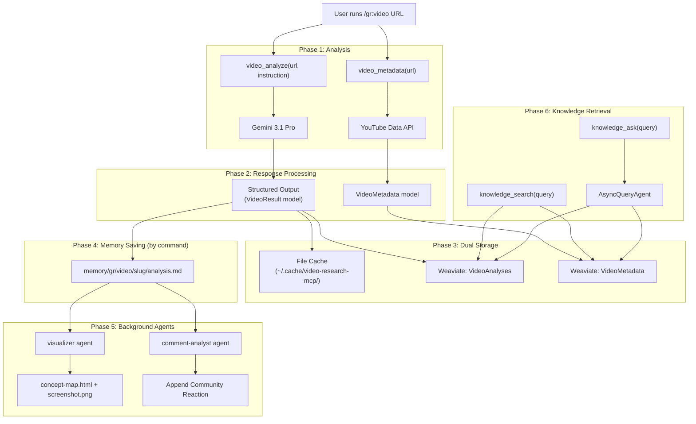
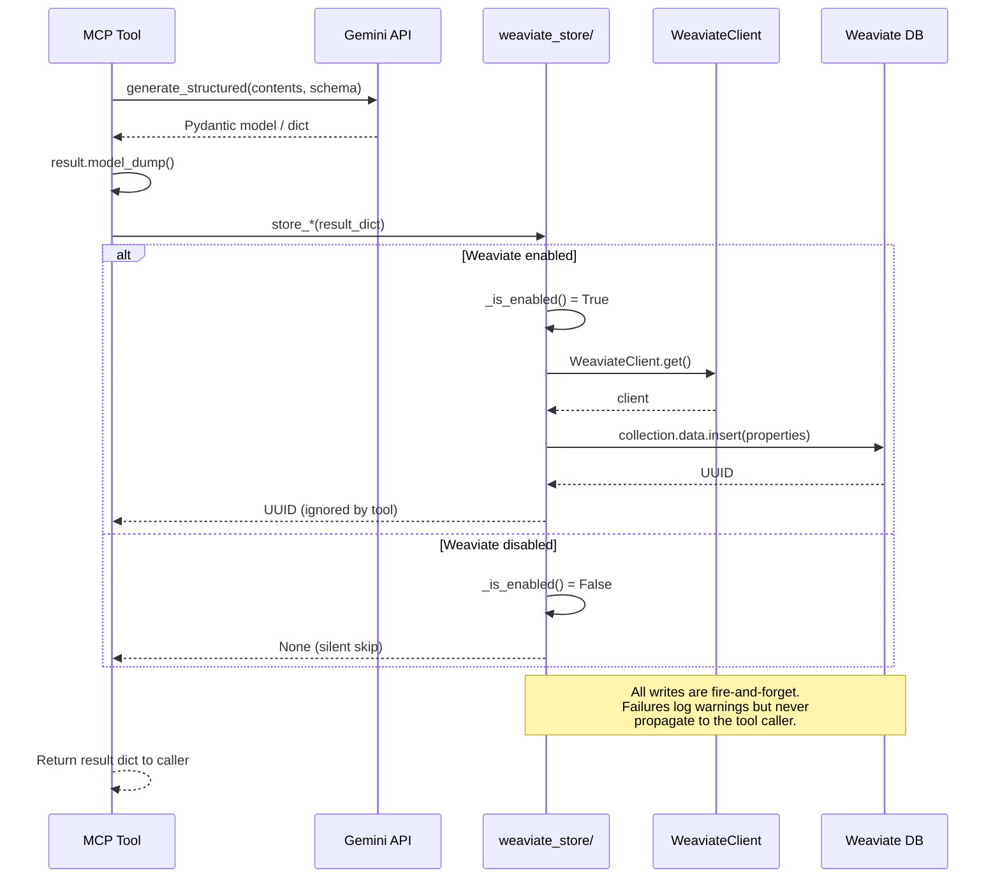
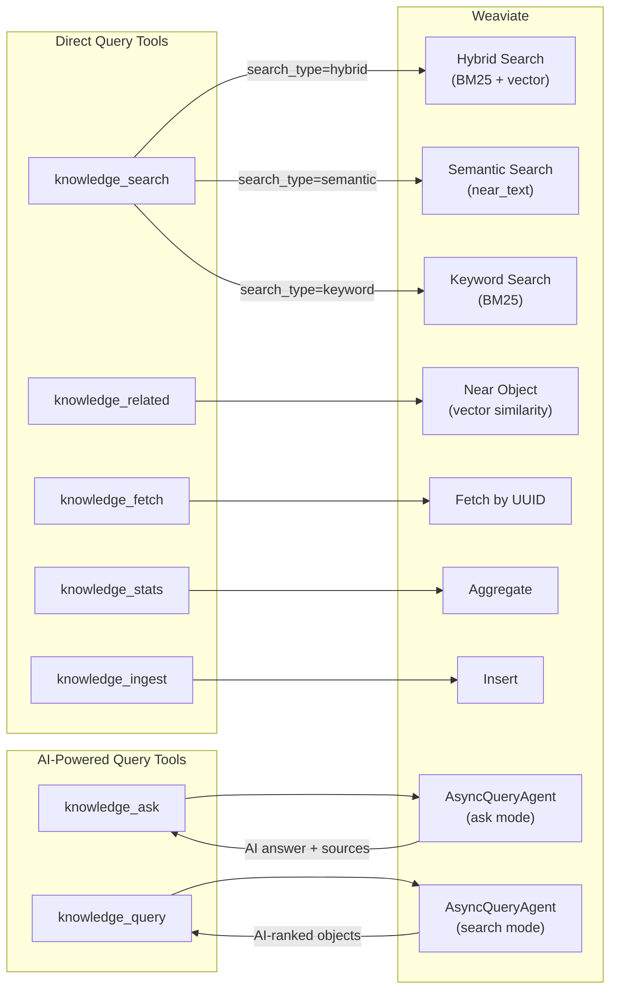
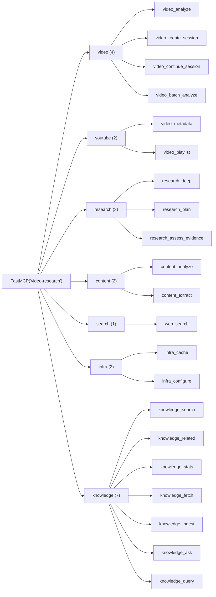

# Data Flow and Architecture Map

Comprehensive reference for every command, tool, agent, skill, storage path, and data flow in the video-research-mcp system. Verified against source code (not docs) as of 2026-02-28.

---

## Table of Contents

1. [System Overview](#1-system-overview)
2. [Complete Tool Inventory (23 tools)](#2-complete-tool-inventory-23-tools)
3. [Complete Command Inventory (8 commands)](#3-complete-command-inventory-8-commands)
4. [Agent Inventory (4 agents)](#4-agent-inventory-4-agents)
5. [Skill Inventory (3 skills)](#5-skill-inventory-3-skills)
6. [Data Flow Diagrams](#6-data-flow-diagrams)
7. [Weaviate Storage Map (11 collections)](#7-weaviate-storage-map-11-collections)
8. [Write-Through Storage Pattern](#8-write-through-storage-pattern)
9. [Knowledge Query Path](#9-knowledge-query-path)
10. [Plugin Asset Inventory](#10-plugin-asset-inventory)
11. [Discrepancies: Docs vs Code](#11-discrepancies-docs-vs-code)

---

## 1. System Overview

---

## 2. Complete Tool Inventory (23 tools)

### video sub-server (4 tools) — `tools/video.py`

| Tool | Parameters | Gemini Model | Stores to Weaviate | Returns |
|------|-----------|-------------|-------------------|---------|
| `video_analyze` | `url`, `file_path`, `instruction`, `output_schema`, `thinking_level`, `use_cache` | Default (Pro) | VideoAnalyses | VideoResult dict or custom schema |
| `video_create_session` | `url`, `file_path`, `description` | Default (Pro) for title | (none) | SessionInfo dict |
| `video_continue_session` | `session_id`, `prompt` | Default (Pro) | SessionTranscripts | SessionResponse dict |
| `video_batch_analyze` | `directory`, `instruction`, `glob_pattern`, `output_schema`, `thinking_level`, `max_files` | Default (Pro) | VideoAnalyses (per file) | BatchVideoResult dict |

Notes:
- `video_analyze` and `video_batch_analyze` share `analyze_video()` in `video_core.py`
- `video_create_session` fetches title via YouTube API first, falls back to Gemini
- `video_continue_session` maintains conversation history via `session_store`
- `video_batch_analyze` uses a semaphore of 3 for concurrent Gemini calls

### youtube sub-server (2 tools) — `tools/youtube.py`

| Tool | Parameters | API Used | Stores to Weaviate | Returns |
|------|-----------|---------|-------------------|---------|
| `video_metadata` | `url` | YouTube Data API v3 | VideoMetadata (deterministic UUID upsert) | VideoMetadata dict |
| `video_playlist` | `url`, `max_items` | YouTube Data API v3 | (none) | PlaylistInfo dict |

Notes:
- `video_metadata` uses `weaviate.util.generate_uuid5(video_id)` for deterministic UUIDs — repeated fetches upsert rather than duplicate
- `video_playlist` does NOT store to Weaviate

### research sub-server (3 tools) — `tools/research.py`

| Tool | Parameters | Gemini Model | Stores to Weaviate | Returns |
|------|-----------|-------------|-------------------|---------|
| `research_deep` | `topic`, `scope`, `thinking_level` | Default (Pro) | ResearchFindings (1 report + N findings) | ResearchReport dict |
| `research_plan` | `topic`, `scope`, `available_agents` | Default (Pro) | ResearchPlans | ResearchPlan dict |
| `research_assess_evidence` | `claim`, `sources`, `context` | Default (Pro) | ResearchFindings (source_tool="research_assess_evidence") | EvidenceAssessment dict |

Notes:
- `research_deep` runs 3 phases: Scope Definition (unstructured) -> Evidence Collection (structured) -> Synthesis (structured)
- `research_deep` stores one report-level object + one object per finding, linked via `belongs_to_report` reference and `report_uuid` property
- `research_assess_evidence` stores in the SAME collection as `research_deep` but with `source_tool="research_assess_evidence"`

### content sub-server (2 tools) — `tools/content.py`

| Tool | Parameters | Gemini Model | Stores to Weaviate | Returns |
|------|-----------|-------------|-------------------|---------|
| `content_analyze` | `instruction`, `file_path`, `url`, `text`, `output_schema`, `thinking_level` | Default (Pro) | ContentAnalyses | ContentResult dict or custom schema |
| `content_extract` | `content`, `schema` | Default (Pro) | (none) | Dict matching provided schema |

Notes:
- `content_analyze` with URL input uses Gemini's `UrlContext` tool for web fetch, with a two-step fallback (unstructured fetch -> reshape)
- `content_extract` does NOT store to Weaviate

### search sub-server (1 tool) — `tools/search.py`

| Tool | Parameters | Gemini Model | Stores to Weaviate | Returns |
|------|-----------|-------------|-------------------|---------|
| `web_search` | `query`, `num_results` | Flash model | WebSearchResults | Dict with query, response, sources |

Notes:
- Uses `GoogleSearch` grounding tool, not standard Gemini generation
- Always uses the Flash model (not default Pro)

### infra sub-server (2 tools) — `tools/infra.py`

| Tool | Parameters | Stores to Weaviate | Returns |
|------|-----------|-------------------|---------|
| `infra_cache` | `action` (stats/list/clear), `content_id` | (none) | Cache stats, entries, or removal count |
| `infra_configure` | `preset`, `model`, `thinking_level`, `temperature` | (none) | Current config, active preset, available presets |

Notes:
- `infra_configure` presets: `best` (3.1 Pro + 3 Flash), `stable` (3 Pro + 3 Flash), `budget` (3 Flash + 3 Flash)
- Neither infra tool touches Weaviate

### knowledge sub-server (7 tools) — `tools/knowledge/`

| Tool | File | Parameters | Query Method | Returns |
|------|------|-----------|-------------|---------|
| `knowledge_search` | `search.py` | `query`, `collections`, `search_type`, `limit`, `alpha`, `evidence_tier`, `source_tool`, `date_from`, `date_to`, `category`, `video_id` | hybrid/semantic/keyword | KnowledgeSearchResult |
| `knowledge_related` | `retrieval.py` | `object_id`, `collection`, `limit` | near_object vector | KnowledgeRelatedResult |
| `knowledge_stats` | `retrieval.py` | `collection`, `group_by` | aggregate | KnowledgeStatsResult |
| `knowledge_fetch` | `retrieval.py` | `object_id`, `collection` | fetch_object_by_id | KnowledgeFetchResult |
| `knowledge_ingest` | `ingest.py` | `collection`, `properties` | data.insert | KnowledgeIngestResult |
| `knowledge_ask` | `agent.py` | `query`, `collections` | AsyncQueryAgent.ask | KnowledgeAskResult |
| `knowledge_query` | `agent.py` | `query`, `collections`, `limit` | AsyncQueryAgent.search | KnowledgeQueryResult |

Notes:
- `knowledge_search` supports 3 modes: `hybrid` (BM25 + vector, default), `semantic` (vector only), `keyword` (BM25 only)
- `knowledge_ask` and `knowledge_query` require the optional `weaviate-agents` package
- `knowledge_ask` returns AI-generated answers with source citations; `knowledge_query` returns raw objects with AI query interpretation
- `knowledge_ingest` validates properties against the schema before insertion
- All knowledge tools return empty/error results gracefully when Weaviate is not configured

---

## 3. Complete Command Inventory (8 commands)

All commands live in `commands/` and are installed to `~/.claude/commands/gr/` by the npm installer.

### `/gr:video` — Video analysis with progressive memory saving

| Property | Value |
|----------|-------|
| File | `commands/video.md` |
| Model | sonnet |
| Tools | `video_analyze`, `video_batch_analyze`, `video_create_session`, `video_continue_session`, `video_metadata`, `video_playlist`, Write, Glob, Read, Bash |
| Agents spawned | `comment-analyst` (background, YouTube only), `visualizer` (background, optional) |
| Memory path | `~/.claude/projects/*/memory/gr/video/<slug>/` |
| Artifacts | `analysis.md`, `frames/` (local files only), `concept-map.html`, `screenshot.png` |

Phases: Analyze -> Save initial results -> Extract frames (local only) -> Enrich with relationships -> Optional visualization

### `/gr:video-chat` — Multi-turn video Q&A session

| Property | Value |
|----------|-------|
| File | `commands/video-chat.md` |
| Model | sonnet |
| Tools | `video_create_session`, `video_continue_session`, Write, Read, Edit, Glob, Bash |
| Agents spawned | `visualizer` (background, at session end, optional) |
| Memory path | `~/.claude/projects/*/memory/gr/video-chat/<slug>/` |
| Artifacts | `analysis.md`, `frames/` (local files only), `concept-map.html`, `screenshot.png` |

Phases: Session setup -> Initialize memory -> Conversation loop (append Q&A) -> Session end (concept extraction, relationship map) -> Optional visualization

### `/gr:research` — Deep research with evidence-tier labeling

| Property | Value |
|----------|-------|
| File | `commands/research.md` |
| Model | sonnet |
| Tools | `web_search`, `research_deep`, `research_plan`, `research_assess_evidence`, Write, Glob, Read, Bash |
| Agents spawned | `visualizer` (background, optional) |
| Memory path | `~/.claude/projects/*/memory/gr/research/<slug>/` |
| Artifacts | `analysis.md`, `evidence-net.html`, `screenshot.png` |

Phases: Research (web_search + research_deep in parallel) -> Save initial results -> Enrich with evidence network -> Optional visualization

### `/gr:analyze` — Content analysis (URL, file, or text)

| Property | Value |
|----------|-------|
| File | `commands/analyze.md` |
| Model | sonnet |
| Tools | `content_analyze`, `content_extract`, Write, Glob, Read, Bash |
| Agents spawned | `visualizer` (background, optional) |
| Memory path | `~/.claude/projects/*/memory/gr/analysis/<slug>/` |
| Artifacts | `analysis.md`, `knowledge-graph.html`, `screenshot.png` |

Phases: Analyze -> Save initial results -> Enrich with knowledge graph -> Optional visualization

### `/gr:search` — Web search via Gemini grounding

| Property | Value |
|----------|-------|
| File | `commands/search.md` |
| Model | sonnet |
| Tools | `web_search` |
| Agents spawned | (none) |
| Memory path | (none — results not saved to memory) |

Simple single-step: web_search -> present results

### `/gr:recall` — Browse and recall past research

| Property | Value |
|----------|-------|
| File | `commands/recall.md` |
| Model | sonnet |
| Tools | Glob, Grep, Read |
| Agents spawned | (none) |
| Memory path | Reads from `~/.claude/projects/*/memory/gr/` |

No MCP tools used. Reads local memory files only. Supports filtering by category, keyword, and knowledge state (fuzzy/unknown).

### `/gr:models` — View and change Gemini model preset

| Property | Value |
|----------|-------|
| File | `commands/models.md` |
| Model | haiku |
| Tools | `infra_configure` |
| Agents spawned | (none) |

Simple config tool. Shows current settings or applies a preset (best/stable/budget).

---

## 4. Agent Inventory (4 agents)

All agents live in `agents/` and are installed to `~/.claude/agents/` by the npm installer.

| Agent | File | Model | Tools Used | Spawned By | Runs In |
|-------|------|-------|-----------|------------|---------|
| `video-analyst` | `agents/video-analyst.md` | sonnet | `video_analyze`, `video_create_session`, `video_continue_session` | User directly | Foreground |
| `researcher` | `agents/researcher.md` | sonnet | `web_search`, `research_deep`, `research_plan`, `research_assess_evidence` | User directly | Foreground |
| `visualizer` | `agents/visualizer.md` | sonnet | Read, Write, Glob, Bash, Playwright (navigate, screenshot, wait_for, close) | `/gr:video`, `/gr:video-chat`, `/gr:research`, `/gr:analyze` | Background |
| `comment-analyst` | `agents/comment-analyst.md` | haiku | Read, Write, Glob, Bash, `mcp__jina__read_url`, `content_analyze`, `video_metadata` | `/gr:video` (YouTube only) | Background |

### visualizer agent

Generates interactive HTML visualizations from analysis data. Template selection:
- `/gr:video`, `/gr:video-chat` -> `video-concept-map` -> `concept-map.html`
- `/gr:research` -> `research-evidence-net` -> `evidence-net.html`
- `/gr:analyze` -> `content-knowledge-graph` -> `knowledge-graph.html`

Workflow: Read analysis.md -> Read template -> Generate HTML -> Screenshot via Playwright -> Append to analysis.md -> Copy to workspace `output/<slug>/`

### comment-analyst agent

Fetches YouTube comments and delegates analysis to Gemini Flash via `content_analyze`. Three fallback methods for comment fetching:
1. YouTube Data API v3 (preferred)
2. Jina `read_url` (fallback)
3. Skip gracefully (final fallback)

Appends "Community Reaction" section to the video's `analysis.md`.

---

## 5. Skill Inventory (3 skills)

All skills live in `skills/` and are installed to `~/.claude/skills/` by the npm installer.

| Skill | Directory | Files | Purpose |
|-------|-----------|-------|---------|
| `video-research` | `skills/video-research/` | `SKILL.md` | Tool usage guide — teaches Claude how to use all MCP tools effectively |
| `gemini-visualize` | `skills/gemini-visualize/` | `SKILL.md`, `templates/video-concept-map.md`, `templates/research-evidence-net.md`, `templates/content-knowledge-graph.md` | Visualization generation guide with 3 HTML templates |
| `weaviate-setup` | `skills/weaviate-setup/` | `SKILL.md` | Interactive onboarding for Weaviate knowledge store setup |

---

## 6. Data Flow Diagrams

### 6.1 End-to-End: Command to Storage

### 6.2 Write-Through Storage Pattern

### 6.3 Knowledge Query Path

### 6.4 Sub-Server Mount Hierarchy

---

## 7. Weaviate Storage Map (11 collections)

All collections are defined in `weaviate_schema/` and created idempotently by `WeaviateClient.ensure_collections()` on first connection. Vectorizer: `text2vec-weaviate` (Weaviate Cloud native).

### Common properties (all collections)

| Property | Type | Vectorized | Filterable | Range | Searchable |
|----------|------|-----------|-----------|-------|-----------|
| `created_at` | date | No | Yes | Yes | default |
| `source_tool` | text | No | Yes | No | No |

### VideoAnalyses

Written by: `video_analyze`, `video_batch_analyze` (via `store_video_analysis`)

| Property | Type | Vectorized | Notes |
|----------|------|-----------|-------|
| `video_id` | text | No | YouTube video ID or file content hash |
| `source_url` | text | No | Original URL or file path |
| `instruction` | text | **Yes** | Analysis instruction used |
| `title` | text | **Yes** | Video title |
| `summary` | text | **Yes** | Analysis summary |
| `key_points` | text[] | **Yes** | Key points extracted |
| `raw_result` | text | No | Full JSON result |
| `timestamps_json` | text | No | Timestamps as JSON array |
| `topics` | text[] | **Yes** | Topics covered |
| `sentiment` | text | No | Overall sentiment |

Cross-references: `has_metadata` -> VideoMetadata

### ContentAnalyses

Written by: `content_analyze` (via `store_content_analysis`)

| Property | Type | Vectorized | Notes |
|----------|------|-----------|-------|
| `source` | text | No | URL, file path, or "(text)" |
| `instruction` | text | **Yes** | Analysis instruction used |
| `title` | text | **Yes** | Content title |
| `summary` | text | **Yes** | Analysis summary |
| `key_points` | text[] | **Yes** | Key points extracted |
| `entities` | text[] | **Yes** | Named entities found |
| `raw_result` | text | No | Full JSON result |
| `structure_notes` | text | **Yes** | Content structure observations |
| `quality_assessment` | text | **Yes** | Quality assessment |

### ResearchFindings

Written by: `research_deep` (via `store_research_finding`), `research_assess_evidence` (via `store_evidence_assessment`)

| Property | Type | Vectorized | Notes |
|----------|------|-----------|-------|
| `topic` | text | **Yes** | Research topic |
| `scope` | text | No | Research scope |
| `claim` | text | **Yes** | Individual finding or claim |
| `evidence_tier` | text | No | CONFIRMED / STRONG INDICATOR / INFERENCE / SPECULATION / UNKNOWN |
| `reasoning` | text | **Yes** | Supporting reasoning |
| `executive_summary` | text | **Yes** | Report executive summary |
| `confidence` | number | No | Confidence score 0-1 (range filterable) |
| `open_questions` | text[] | No | Open research questions |
| `supporting` | text[] | **Yes** | Supporting evidence sources |
| `contradicting` | text[] | **Yes** | Contradicting evidence sources |
| `methodology_critique` | text | **Yes** | Critique of research methodology |
| `recommendations` | text[] | **Yes** | Action recommendations |
| `report_uuid` | text | No | Parent report UUID (for finding -> report linkage) |

Cross-references: `belongs_to_report` -> ResearchFindings (self-referencing)

Note: `research_deep` creates 1 report object (empty `claim`, populated `executive_summary`) + N finding objects (populated `claim`, empty `executive_summary`). Findings are linked to the report via both `report_uuid` property and `belongs_to_report` reference.

### ResearchPlans

Written by: `research_plan` (via `store_research_plan`)

| Property | Type | Vectorized | Notes |
|----------|------|-----------|-------|
| `topic` | text | **Yes** | Research topic |
| `scope` | text | No | Research scope |
| `task_decomposition` | text[] | **Yes** | Task breakdown |
| `phases_json` | text | No | Phases as JSON |
| `recommended_models_json` | text | No | Recommended models as JSON |

### VideoMetadata

Written by: `video_metadata` (via `store_video_metadata`)

| Property | Type | Vectorized | Notes |
|----------|------|-----------|-------|
| `video_id` | text | No | YouTube video ID |
| `title` | text | **Yes** | Video title |
| `description` | text | **Yes** | Video description |
| `channel_title` | text | **Yes** | Channel name |
| `tags` | text[] | **Yes** | Video tags |
| `view_count` | int | No | Range filterable |
| `like_count` | int | No | Range filterable |
| `duration` | text | No | Duration string |
| `published_at` | text | No | Publish date |
| `channel_id` | text | No | YouTube channel ID |
| `comment_count` | int | No | Range filterable |
| `duration_seconds` | int | No | Range filterable |
| `category` | text | **Yes** | Video category label |
| `definition` | text | No | hd/sd |
| `has_captions` | boolean | No | Whether captions available |
| `default_language` | text | No | Language code |

Note: Uses deterministic UUID via `weaviate.util.generate_uuid5(video_id)` — repeated fetches replace rather than duplicate.

### SessionTranscripts

Written by: `video_continue_session` (via `store_session_turn`)

| Property | Type | Vectorized | Notes |
|----------|------|-----------|-------|
| `session_id` | text | No | Session ID |
| `video_title` | text | **Yes** | Video title for context |
| `turn_index` | int | No | Turn number (range filterable) |
| `turn_prompt` | text | **Yes** | User prompt |
| `turn_response` | text | **Yes** | Model response |

### WebSearchResults

Written by: `web_search` (via `store_web_search`)

| Property | Type | Vectorized | Notes |
|----------|------|-----------|-------|
| `query` | text | **Yes** | Search query |
| `response` | text | **Yes** | Gemini response text |
| `sources_json` | text | No | Grounding sources as JSON |

---

## 8. Write-Through Storage Pattern

Every tool that calls Gemini follows this pattern (defined in `weaviate_store/`):

1. Tool calls Gemini and gets a result dict
2. Tool calls the corresponding `store_*()` function with the result
3. `store_*()` checks `_is_enabled()` — returns `None` if Weaviate not configured
4. If enabled, runs `collection.data.insert()` in `asyncio.to_thread()` (non-blocking)
5. Failures are caught and logged at WARNING level — never propagated to the caller
6. Tool returns the result dict to the MCP caller regardless of store outcome

### Tools that store vs. tools that don't

| Stores to Weaviate | Does NOT store |
|-------------------|---------------|
| `video_analyze` | `video_create_session` |
| `video_batch_analyze` | `video_playlist` |
| `video_continue_session` | `content_extract` |
| `video_metadata` | `infra_cache` |
| `content_analyze` | `infra_configure` |
| `research_deep` | All 7 knowledge tools (they READ from Weaviate) |
| `research_plan` | |
| `research_assess_evidence` | |
| `web_search` | |

9 tools write, 12 tools do not write to Weaviate.

---

## 9. Knowledge Query Path

### Direct query tools (5)

These use the Weaviate Python v4 client directly:

- **`knowledge_search`**: Dispatches to `hybrid`, `near_text`, or `bm25` based on `search_type`. Searches across all or specified collections. Supports filters: `evidence_tier`, `source_tool`, `date_from`, `date_to`, `category`, `video_id`. Filters are collection-aware — conditions are skipped for collections lacking the property.
- **`knowledge_related`**: Uses `near_object` vector search to find semantically similar objects in the same collection.
- **`knowledge_fetch`**: Direct UUID lookup via `fetch_object_by_id`.
- **`knowledge_stats`**: Uses `aggregate.over_all()` for counts, with optional `group_by` aggregation.
- **`knowledge_ingest`**: Direct `data.insert()` with property validation against schema.

### AI-powered query tools (2)

These use `weaviate-agents` AsyncQueryAgent (optional dependency):

- **`knowledge_ask`**: Calls `agent.ask(query)` — returns an AI-generated answer synthesized from stored objects, with source citations (collection + object_id).
- **`knowledge_query`**: Calls `agent.search(query, limit)` — returns raw objects but with AI-powered query interpretation for better results than pure vector search.

Both tools cache the AsyncQueryAgent instance per collection set, invalidating when the Weaviate client reconnects.

---

## 10. Plugin Asset Inventory

### npm installer FILE_MAP (`bin/lib/copy.js`)

The npm package copies 17 files to `~/.claude/`:

**Commands (7 files) -> `~/.claude/commands/gr/`**

| Source | Destination | Command |
|--------|-----------|---------|
| `commands/video.md` | `commands/gr/video.md` | `/gr:video` |
| `commands/video-chat.md` | `commands/gr/video-chat.md` | `/gr:video-chat` |
| `commands/research.md` | `commands/gr/research.md` | `/gr:research` |
| `commands/analyze.md` | `commands/gr/analyze.md` | `/gr:analyze` |
| `commands/search.md` | `commands/gr/search.md` | `/gr:search` |
| `commands/recall.md` | `commands/gr/recall.md` | `/gr:recall` |
| `commands/models.md` | `commands/gr/models.md` | `/gr:models` |

**Skills (6 files) -> `~/.claude/skills/`**

| Source | Destination |
|--------|-----------|
| `skills/video-research/SKILL.md` | `skills/video-research/SKILL.md` |
| `skills/gemini-visualize/SKILL.md` | `skills/gemini-visualize/SKILL.md` |
| `skills/gemini-visualize/templates/video-concept-map.md` | `skills/gemini-visualize/templates/video-concept-map.md` |
| `skills/gemini-visualize/templates/research-evidence-net.md` | `skills/gemini-visualize/templates/research-evidence-net.md` |
| `skills/gemini-visualize/templates/content-knowledge-graph.md` | `skills/gemini-visualize/templates/content-knowledge-graph.md` |
| `skills/weaviate-setup/SKILL.md` | `skills/weaviate-setup/SKILL.md` |

**Agents (4 files) -> `~/.claude/agents/`**

| Source | Destination |
|--------|-----------|
| `agents/researcher.md` | `agents/researcher.md` |
| `agents/video-analyst.md` | `agents/video-analyst.md` |
| `agents/visualizer.md` | `agents/visualizer.md` |
| `agents/comment-analyst.md` | `agents/comment-analyst.md` |

### Cleanup directories (deepest first)

On uninstall, these directories are removed if empty:
1. `skills/gemini-visualize/templates`
2. `skills/gemini-visualize`
3. `skills/video-research`
4. `skills/weaviate-setup`
5. `commands/gr`

---

## 11. Discrepancies: Docs vs Code

Verified during this audit:

| Area | CLAUDE.md / Docs claim | Actual code | Impact |
|------|----------------------|------------|--------|
| Tool count | CLAUDE.md says "23 tools" | 23 tools | **Resolved** |
| Knowledge tools in CLAUDE.md table | Lists 7 knowledge tools | 7 tools registered (8 including `knowledge_ask`) | **Resolved** |
| Knowledge `__init__.py` docstring | Says "8 tools" | 8 tools registered (7 search/CRUD + `knowledge_ask` alias) | Consistent |
| video-research SKILL.md | Says "13 tools" | 23 tools exist; skill only documents the original 13 (pre-knowledge expansion) | Skill guide missing knowledge tools |
| weaviate-setup SKILL.md | Says "13 existing tools automatically write" and "4 knowledge query tools" | 9 tools write to Weaviate; 8 knowledge tools exist | Both numbers outdated |
| Model presets in `commands/models.md` | Says `stable` uses "3 Pro" | `config.py` shows `stable` uses `gemini-3-pro-preview` | Consistent |
| Test count in CLAUDE.md | Says "473 tests" | 473 tests (verified) | **Resolved** |
