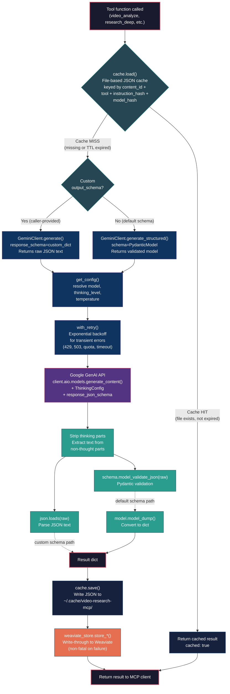
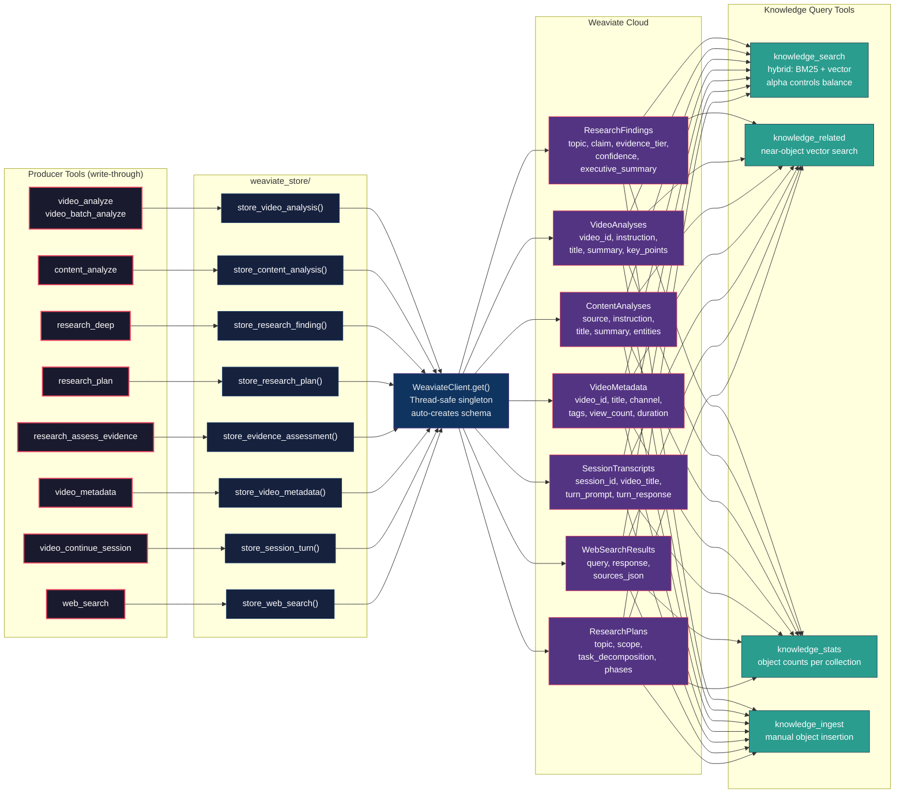

# Architecture Diagrams

Visual reference for the video-research MCP server architecture. Each section contains a Mermaid diagram with a brief description.

---

## 1. Server Mounting Hierarchy

The root `FastMCP("video-research")` server mounts 7 sub-servers, each owning a distinct set of tools. The lifespan hook manages shutdown of shared clients (GeminiClient, WeaviateClient).

```mermaid
graph TD
    classDef root fill:#1a1a2e,stroke:#e94560,color:#fff,stroke-width:2px
    classDef subserver fill:#16213e,stroke:#0f3460,color:#fff,stroke-width:1px
    classDef tool fill:#0f3460,stroke:#533483,color:#eee,stroke-width:1px
    classDef lifecycle fill:#533483,stroke:#e94560,color:#fff,stroke-width:1px

    ROOT["FastMCP('video-research')<br/>server.py"]:::root

    LIFE["_lifespan<br/>GeminiClient.close_all()<br/>WeaviateClient.aclose()"]:::lifecycle
    ROOT -. "lifespan hook" .-> LIFE

    VS["video_server<br/>FastMCP('video')"]:::subserver
    YS["youtube_server<br/>FastMCP('youtube')"]:::subserver
    RS["research_server<br/>FastMCP('research')"]:::subserver
    CS["content_server<br/>FastMCP('content')"]:::subserver
    SS["search_server<br/>FastMCP('search')"]:::subserver
    IS["infra_server<br/>FastMCP('infra')"]:::subserver
    KS["knowledge_server<br/>FastMCP('knowledge')"]:::subserver

    ROOT --> VS
    ROOT --> YS
    ROOT --> RS
    ROOT --> CS
    ROOT --> SS
    ROOT --> IS
    ROOT --> KS

    V1["video_analyze"]:::tool
    V2["video_create_session"]:::tool
    V3["video_continue_session"]:::tool
    V4["video_batch_analyze"]:::tool
    VS --> V1
    VS --> V2
    VS --> V3
    VS --> V4

    Y1["video_metadata"]:::tool
    Y2["video_playlist"]:::tool
    YS --> Y1
    YS --> Y2

    R1["research_deep"]:::tool
    R2["research_plan"]:::tool
    R3["research_assess_evidence"]:::tool
    RS --> R1
    RS --> R2
    RS --> R3

    C1["content_analyze"]:::tool
    C2["content_extract"]:::tool
    CS --> C1
    CS --> C2

    S1["web_search"]:::tool
    SS --> S1

    I1["infra_cache"]:::tool
    I2["infra_configure"]:::tool
    IS --> I1
    IS --> I2

    K1["knowledge_search"]:::tool
    K2["knowledge_related"]:::tool
    K3["knowledge_stats"]:::tool
    K4["knowledge_ingest"]:::tool
    KS --> K1
    KS --> K2
    KS --> K3
    KS --> K4
```



---

## 2. GeminiClient Request Flow

Every tool that calls Gemini follows this pipeline: check the file-based cache, call GeminiClient (which delegates to the Google GenAI SDK with retry logic), validate the response, write back to cache, and optionally persist to Weaviate. The diagram shows both cache-hit and cache-miss paths.



---

## 3. Session Lifecycle

Video sessions enable multi-turn conversations about a single video. The SessionStore holds sessions in memory with optional SQLite persistence. Sessions are evicted after a configurable TTL and history is trimmed to prevent unbounded growth.

```mermaid
stateDiagram-v2
    classDef active fill:#2a9d8f,color:#fff
    classDef expired fill:#e76f51,color:#fff
    classDef persist fill:#0f3460,color:#fff

    [*] --> CreateSession: video_create_session(url)

    state CreateSession {
        direction LR
        Evict[Evict expired sessions] --> CapCheck[Check max_sessions cap]
        CapCheck --> Allocate[Allocate new VideoSession<br/>session_id = uuid4 hex 12]
    }

    CreateSession --> Active: SessionInfo returned<br/>(session_id, video_title)

    state Active {
        direction TB
        InMemory[In-memory dict<br/>SessionStore._sessions]
        SQLite[SQLite WAL persistence<br/>SessionDB.save_sync()]
        InMemory --> SQLite: Write-through<br/>(if GEMINI_SESSION_DB set)
    }

    Active --> ContinueTurn: video_continue_session(session_id, prompt)

    state ContinueTurn {
        direction TB
        Lookup[SessionStore.get(session_id)]
        BuildHistory[Build contents from<br/>session.history + new prompt]
        GeminiCall[GeminiClient generate<br/>with full history context]
        AddTurn[session_store.add_turn()<br/>append user + model Content]
        TrimHistory[Trim history to<br/>session_max_turns * 2 items]
        WeaviateStore[store_session_turn()<br/>to SessionTranscripts]
        Lookup --> BuildHistory
        BuildHistory --> GeminiCall
        GeminiCall --> AddTurn
        AddTurn --> TrimHistory
        TrimHistory --> WeaviateStore
    }

    ContinueTurn --> Active: SessionResponse returned<br/>(response, turn_count)

    Active --> RecoverFromDB: Session evicted from memory<br/>but exists in SQLite
    RecoverFromDB --> Active: SessionDB.load_sync()<br/>restores to memory

    Active --> Expired: TTL exceeded<br/>(session_timeout_hours)
    Active --> EvictedByCap: max_sessions reached<br/>(oldest evicted)

    Expired --> [*]
    EvictedByCap --> [*]
```

---

## 4. Weaviate Knowledge Store Data Flow

All tool results are written through to Weaviate collections via `weaviate_store/`. The knowledge tools (`knowledge_*`) provide query access. The 11 collections store different data types, each with common properties (`created_at`, `source_tool`) plus domain-specific fields.


